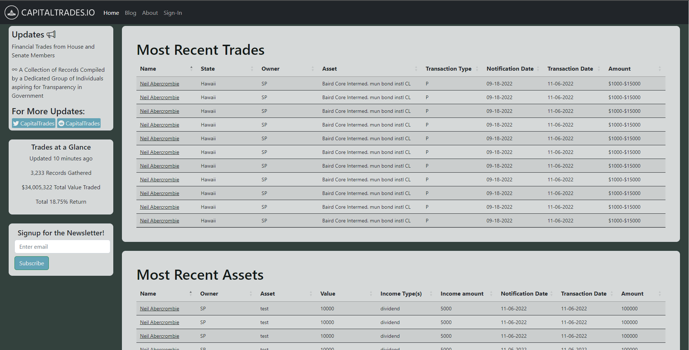

<!-- Improved compatibility of back to top link: See: https://github.com/othneildrew/Best-README-Template/pull/73 -->

<!--
*** Thanks for checking out the Best-README-Template. If you have a suggestion
*** that would make this better, please fork the repo and create a pull request
*** or simply open an issue with the tag "enhancement".
*** Don't forget to give the project a star!
*** Thanks again! Now go create something AMAZING! :D
-->

<!-- PROJECT SHIELDS -->
<!--
*** I'm using markdown "reference style" links for readability.
*** Reference links are enclosed in brackets [ ] instead of parentheses ( ).
*** See the bottom of this document for the declaration of the reference variables
*** for contributors-url, forks-url, etc. This is an optional, concise syntax you may use.
*** https://www.markdownguide.org/basic-syntax/#reference-style-links
-->

<!-- PROJECT LOGO -->
 

  

  <h3 align="center">Capitaltrades.io - Congressional Stock Tracker</h3>

  

    Web application to track the stock trades of Members of Congress
     
     
    <a href="https://github.com/othneildrew/Best-README-Template">View Demo</a>
    ·
    <a href="https://github.com/JonTheAlex/stock_tracker/issues">Report Bug</a>
    ·
    <a href="https://github.com/JonTheAlex/stock_tracker/issues">Request Feature</a>
  

<!-- ABOUT THE PROJECT -->
## About The Project

Capitaltrades.io is a full stack web application that displays the trades/assets of members of Congress. This project started from a python script I wrote 3 years ago while working with our local tech scene.  It started with parsing pdf records from the Ethics Committee website and evolved to include basic image recognition with OpenCV and including both the House and Senate record collections.  I wanted to give the script more of a presentable front end and learned web development (MERN) with <a href="https://leonnoel.com/100devs/">#100Devs</a>.

How Does it Work?:
* A script crawls the Ethics Committee website and pulls down all the records that are posted.
* The records are organized by person/year for easy organization
* Those records are then uploaded into a Mongodb database, where a Node.js app manages the website/backend.  Bootstrap is     used for the front-end for easy mobile responsiveness

For the future there are a few things i would like to implement into the project. More JS to prevent page reloads, and more indepth analysis of returns, graphs, more interactiveness of the website

### Built With

* Node.JS
* Express.JS
* Bootstrap
* jQuery
* EJS

<!-- LICENSE -->
## License

Distributed under the CC BY-NC-ND License. See `LICENSE.txt` for more information.

(<a href="#readme-top">back to top</a>)

<!-- CONTACT -->
## Contact

Your Name - [[@your_twitter]]([https://twitter.com/JonTheAlex](https://twitter.com/JonAlex314526))

Project Link: [https://github.com/your_username/repo_name](https://github.com/JonTheAlex/stock_tracker))

(<a href="#readme-top">back to top</a>)

